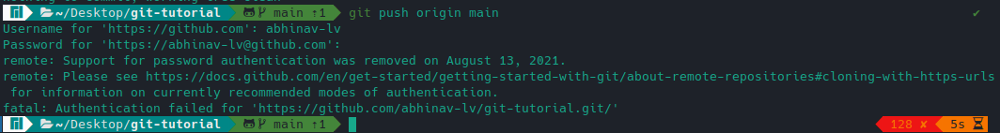
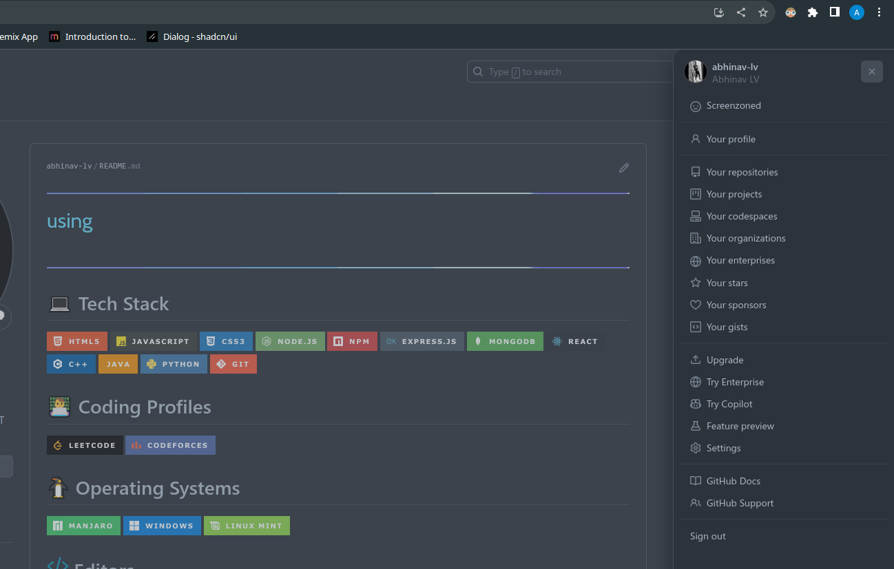
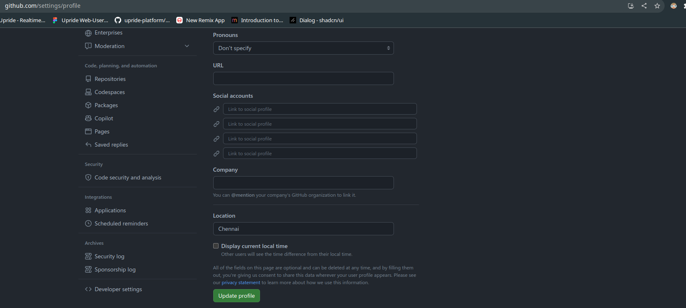
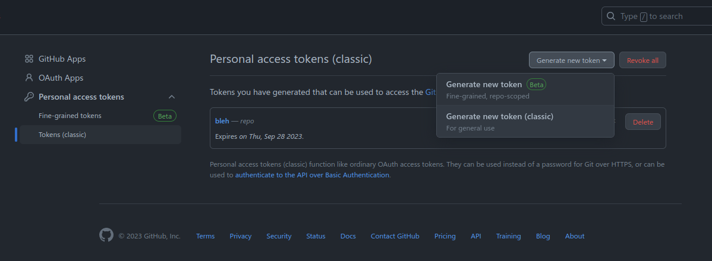
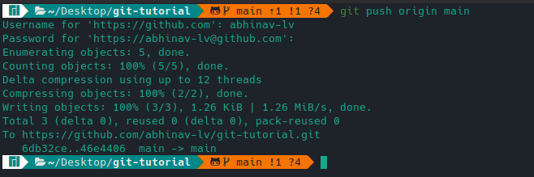

# Welcome to this git tutorial!

## Go through the following steps:

- ### Install Git

  - [Windows](https://git-scm.com/download/win)
  - [MAC](https://git-scm.com/download/mac)

- ### Set up your git credentials

  - Configure username:

    ```
    git config --global user.name "your_name"
    ```

    Make sure your name is in double quotation (""). Also, try to use the same username that you gave on GitHub.

  - Configure email:

    ```
    git config --global user.email "your_email"
    ```

    Again, try to use the same email that you gave on GitHub.

- ### Open `cmd` on Windows or `Terminal` on Mac and use the following commands:

        git clone https://github.com/abhinav-lv/git-tutorial.git

  You'll see a folder named "git-tutorial". Go into this folder and open a terminal there. You've just cloned the repository into your local machine! Now before you make any changes, it's a good idea to make a different branch so that if you mess up any commits, your main branch won't be affected. Follow the steps below to create a new branch:

- ### Create a new branch

        git checkout -b branch_name

  The "branch_name" can be any name of your choice. To make it simple for this tutorial, keep the branch name as <b>your</b> first name. This will come in handy later when you'll be learning about pull requests.

- ### Make changes !

  Mess around, add new files, edit existing files, etc. But make sure you don't edit the `readme.md` file.

- ### Stage the new files for tracking.

  - Run the following command:

    ```
    git status
    ```

  - You'll see that the files you've added / edited show up as "untracked" by git. To stage them, run this command:

    ```
    git add .
    ```

    This stages all the changed files for commit.

- ### Commit !

  - To commit your changes (make them permanent), you need to commit them. You can commit your change by running the command:

    ```
    git commit -m "any short descriptive message here"
    ```

  - Make sure to give a message in double quotation after the `-m` flag. This should be a short description of the changes you made in this commit.

- ### Push the changes to the remote repository

  - The changes that you've made are saved in your local repository (the one on your computer). To update the same changes in the remote version (the one on GitHub), you need to push those changes.

  - But since you guys are doing this for the first time, there's a bit of a setup involved. For any action that you perform from the terminal that interacts with a repository on GitHub, you'll first need to authenticate yourself.

  - You can try pushing your changes by typing:

    ```
    git push origin your_branch_name
    ```

    You'll be asked your username and password for github on your terminal. But even if you type in the correct credentials, you'll probably be getting this error:

    

  - Now there are many ways with which you can authenticate yourself:
    - GitHub CLI
    - SSH keys (for access over SSH)
    - Personal Access Tokens (for access over HTTPS)
      <br>
      <br>
  - To keep this tutorial simple, we will be using Personal Access Tokens. Keep in mind that this is more of a temporary solution and it's recommended to either use the GitHub CLI or SSH keys (I use SSH). For more information, you can refer to the GitHub docs.

  - To generate your Personal Access Token, go to GitHub > Settings

    

  - Once you're in the Settings, scroll down to the bottom of the left sidebar and click on `Developer Settings`

    

  - Now expand the drop down for Personal access tokens, and select `Tokens(classic)` > Generate new token (classic).

    

  - Follow the steps on GitHub, then copy the key and save it somewhere safe.

  - Now try pushing again:

    ```
    git push origin your_branch_name
    ```

  - Git will ask your username. After entering your GitHub username, when git will ask your password. But now instead of entering your GitHub password, paste the key we got above and hit Enter. You'll probably see an output like this:

    

    If you get this output, congratulations! You've successfully pushed your code from your local repo to GitHub from the terminal! This is the way to do it, please don't upload your code directly on GitHub by uploading the code files!

  - Now if you go to GitHub, you'll see your branch listed there, with the changes you made reflecting on that branch. The next step is making a pull request to "merge" your changes to the main branch. That's a whole other topic to be discussed!